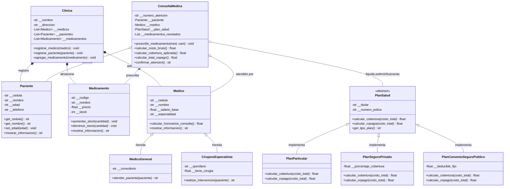

# MediCare Pro — Sistema de Gestión Clínica y Facturación Médica


---

## Datos de la Evaluación y Estudiante

* **Estudiante:** Luis Alberto Villegas Merchan
* **Materia:** Programación Orientada a Objetos / Programación Estructurada
* **Evaluación:** Examen Parcial P1 — Presentación y Explicación del Proyecto
* **Lenguaje:** Python 3.14
* **Repositorio GitHub:** [https://github.com/luisvillegas190/examen-de-programacion-estructurada](https://github.com/luisvillegas190/examen-de-programacion-estructurada)

---

##  Tabla de Contenidos

1. [Descripción del Proyecto](#-descripción-del-proyecto)
2. [Objetivos del Proyecto](#-objetivos-del-proyecto)
3. [Principios de POO Integrados (Semanas 1, 2 y 3)](#-principios-de-poo-integrados)
4. [Diagrama de Clases UML](#-diagrama-de-clases-uml)
5. [Estructura del Código Fuente](#-estructura-del-código-fuente)
6. [Instalación y Ejecución](#-instalación-y-ejecución)
7. [Demostración de Resultados](#-demostración-de-resultados)
8. [🎬 Guión para la Grabación del Video (Máx. 10 Minutos)](#-guión-para-la-grabación-del-video-máx-10-minutos)

---

##  Descripción del Proyecto

**MediCare Pro** es una solución de software orientada a objetos diseñada para la administración hospitalaria, gestión de historias clínicas, farmacia interna y liquidación automatizada de consultas médicas con cálculo de coberturas y copagos según el seguro de salud del paciente.

El sistema modela el flujo completo de una clínica:
1. Registro y control seguro de **Pacientes** y **Medicamentos**.
2. Administración del personal médico (**Médicos Generales** y **Cirujanos Especialistas**).
3. Agrupación y gestión institucional a través de la clase central **Clínica**.
4. Liquidación polimórfica de **Consultas Médicas** mediante una interfaz abstracta de **Planes de Salud** (Particular, Seguro Privado y Convenio Seguro Social).

---

##  Objetivos del Proyecto

* **Consolidar los aprendizajes de las Semanas 1, 2 y 3** en una arquitectura de software robusta, desacoplada y escalable.
* Demostrar la **encapsulación estricta** mediante atributos privados (`__`) y validaciones de negocio en tiempo real.
* Reutilizar código y modelar especializaciones mediante **herencia simple**.
* Implementar **composición** para representar relaciones "todo-parte" entre la clínica, médicos, medicamentos y consultas.
* Aplicar **polimorfismo dinámico** y **clases abstractas (`ABC`)** para liquidar pagos y seguros sin condicionales `if/isinstance`.

---

##  Principios de POO Integrados

### 1. Semana 1: Clases, Objetos, Encapsulación y Validación
* **Atributos Privados (`__`):** Ocultamiento de la información sensible del paciente (`__cedula`, `__nombre`, `__edad`, `__telefono`) y del medicamento (`__precio`, `__stock`).
* **Getters y Setters:** Métodos públicos de consulta y mutación que garantizan la integridad del estado interno del objeto.
* **Validación con Pydantic:** Se utilizan modelos `BaseModel` (`DatosPaciente`, `DatosMedicamento`, `DatosMedico`) para asegurar:
  * Cédulas y teléfonos válidos con expresiones regulares (`r"^\d{10}$"`).
  * Longitudes mínimas de nombres.
  * Precios y honorarios estrictamente positivos (`gt=0`).
  * Edades lógicas (`0 <= edad <= 125`).

### 2. Semana 2: Herencia y Composición
* **Herencia (`is-a`):**
  * Clase Padre: `Medico` (define `salario_base`, `cedula`, `especialidad` y honorarios base).
  * Subclases Hijas:
    * `MedicoGeneral`: Especializado en atención ambulatoria en consultorio.
    * `CirujanoEspecialista`: Especializado en intervenciones de quirófano con bono quirúrgico y honorarios especializados.
* **Composición (`has-a`):**
  * `Clinica`: Administra colecciones dinámicas de médicos, pacientes y medicamentos.
  * `ConsultaMedica`: Compone un paciente, un médico tratante, un plan de salud y una lista de medicamentos recetados con sus cantidades.

### 3. Semana 3: Clases Abstractas, Interfaces y Polimorfismo
* **Clase Abstracta / Interfaz (`PlanSalud` con `abc.ABC`):**
  * Declara los métodos abstractos `@abstractmethod def calcular_cobertura(...)` y `@abstractmethod def calcular_copago(...)`.
  * Impide la instanciación de planes genéricos no definidos.
* **Sobrescritura de Métodos (`Method Overriding`):**
  * `PlanParticular`: Aplica tarifa completa (con 5% de descuento por pronto pago en montos superiores a \$150).
  * `PlanSeguroPrivado`: Cobertura del 80% sobre el total (el paciente cancela el 20% de copago).
  * `PlanConvenioSeguroPublico`: Cobertura total de la atención con deducible administrativo fijo de \$10.00.
* **Polimorfismo Dinámico en `ConsultaMedica`:**
  * La consulta delega el cálculo financiero invocando `self.__plan_salud.calcular_copago(costo_bruto)`.
  * **Sin condicionales:** El sistema no necesita saber el tipo concreto de seguro; la llamada se resuelve dinámicamente en tiempo de ejecución.

---

##  Diagrama de Clases UML



---

##  Estructura del Código Fuente

```text
examen-de-programacion-estructurada/
│
├── modelo.py              # Definición de clases del dominio (POO Semanas 1, 2 y 3)
├── main.py                # Suite de ejecución, pruebas y demostración automatizada
├── requirements.txt       # Dependencias del proyecto (Pydantic, Ruff)
├── .gitignore             # Exclusión de archivos de compilación, caché y temporales
├── README.md              # Documentación técnica y guía de sustentación del examen
└── diagramas/
    └── uml_examen.puml    # Diagrama de clases editable en formato PlantUML
```

---

##  Instalación y Ejecución

### 1. Clonar el repositorio
```bash
git clone https://github.com/luisvillegas190/examen-de-programacion-estructurada.git
cd examen-de-programacion-estructurada
```

### 2. Instalar dependencias
```bash
python -m pip install -r requirements.txt
```

### 3. Ejecutar la suite del proyecto
```bash
python main.py
```

### 4. Verificar calidad de código con Ruff
```bash
python -m ruff check .
```

---

##  Demostración de Resultados

Al ejecutar `python main.py`, el sistema valida automáticamente:
1. **Semana 1:** Crea paciente y medicamento con atributos privados, ejecuta getters/setters y rechaza datos anómalos mediante Pydantic (`[OK]`).
2. **Semana 2:** Crea instancias de `MedicoGeneral` y `CirujanoEspecialista` invocando sus métodos heredados y propios, y genera el resumen institucional de la `Clinica` (`[OK]`).
3. **Semana 3:** Comprueba que `PlanSalud` no puede instanciarse directamente (lanza `TypeError`), procesa tres consultas con distintos planes de salud liquidando los copagos polimórficamente y descuenta el stock de medicamentos (`[OK]`).

---

